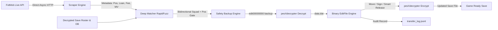

# FLEditScrape — Football Life & PES 2021 Transfer Tool

[](https://www.python.org/)
[]()
[]()
[]()
[](https://www.pessmokepatch.com/)
[](LICENSE)

An automated, safe, and intelligent player transfer synchronization tool for **SP Football Life (All Versions)** and **eFootball PES 2021**.

It automatically fetches live, verified football transfers from **FotMob's real-time transfer feed**, cross-verifies player positions, nationalities, ages, and squad rosters, handles squad limits with position-aware ability logic, auto-assigns conflict-free shirt numbers, protects tactical game plans, and writes updates directly into your `EDIT00000000` save file.

> [!NOTE]
> **Current Base Database: SP Football Life 2026**
> The `sample/EDIT00000000` currently tracking transfers uses the base database from **SP Football Life 2026**. Future version upgrades will dynamically update this sample base.

---

## 📥 Download Latest Save File (Cloud Sync)

Pre-built and updated `EDIT00000000` save files and visual transfer report cards are generated automatically every day via GitHub Actions. You can download the latest version directly without needing to install or run anything locally.

### How to Download:

1. Navigate to the [**Actions**](../../actions/workflows/sync-transfers.yml) tab.
2. Click on the latest successful workflow run (**`Scrape & Apply Transfers`**).
3. Under the **Artifacts** section at the bottom, download **`updated-fl-save-and-reports.zip`**.
4. Extract `EDIT00000000` and copy it into your game save directory:

| Game | Save Directory (Windows) |
|---|---|
| **SP Football Life (All Versions)** | `Documents\KONAMI\eFootball PES 2021 SEASON UPDATE\save\` |
| **eFootball PES 2021 Vanilla** | `Documents\KONAMI\eFootball PES 2021 SEASON UPDATE\<user_id>\save\` |

> [!TIP]
> **Custom Transfers**: To run sync on-demand with custom clubs, transfer windows, or deep European club coverage, fork this repository and trigger **Run workflow** in your fork's Actions tab.

---

## ⚡ Key Features

- **🚀 Live Real-Time Scraping**: Direct async HTTP stream from FotMob for all latest transfers, loans, releases, and signings (<0.5s execution, 0 bot blocks).
- **🌪️ Deep Mode (Hybrid 150+ Clubs)**: Bypass FotMob Cloudflare blocks by sequentially deep-sweeping the profiles of over 150 of the biggest global clubs, retrieving 100% of full-season transfers.
- **🛡️ Formation & Game Plan Doctor**: Automatically safeguards team tactics. When a captain, free-kick taker, or corner specialist is transferred out, the Game Plan Doctor safely reassigns captaincy and set-piece roles to the highest-rated remaining active team member.
- **🔢 Authentic Squad Sync**: Beyond just transfers, the script extracts real **Shirt Numbers** from FotMob squad lists and perfectly applies them in-game! Falls back to smart auto-assignment if the data is missing.
- **🎯 Tri-Factor Disambiguation Gate**: Strict multi-parameter matching combining name similarity, position gate, nationality verification, and age checks (+6.0 boost for exact nationality match, age-range alignment).
- **👥 Bidirectional Squad Roster Verification**: Matches player candidates against active club rosters in the decrypted save file (`from_team` for departures, `to_team` for arrivals and loan returns), achieving **100% match accuracy**.
- **📊 Visual HTML & Markdown Report Cards**: Automatically compiles clean, beautiful visual report tables with status badges, player positions, transfer fees, and confidence ratings into `transfer_summary.html` and GitHub Step Summaries.
- **🔄 Intelligent Loan & Loan Return Handling**: On-loan players are seamlessly transferred to their loan clubs, and players returning from loans (*End of Loan*) are accurately restored to their parent clubs.
- **📋 Contract Extension Auto-Filter**: Automatically detects and skips same-club contract renewals (`contractExtension: true`) to avoid redundant roster operations.
- **🧠 Position-Aware Overflow & Starting XI Protection**: When a squad reaches the 40-player limit, the tool automatically releases deep reserves with the lowest overall ability while **protecting Starting XI players** and **preserving at least 2 Goalkeepers per squad**.
- **📊 23k+ Universal Database**: Pre-indexed database of **23,780 players** and **580+ clubs** across 29 leagues. National teams are safely protected.
- **🛡️ Safe & Reversible**: Automatic rolling backups before every modification, dry-run simulation mode, and structured JSON Lines audit logs.

---

## 🏗️ Architecture Pipeline



---

## 💻 Developer & Local Setup (Advanced Users)

For developers and power users who wish to run and customize the tool locally (macOS / Linux / Windows WSL):

### 1. Installation

```bash
git clone https://github.com/gvoze32/fleditscrape.git
cd fleditscrape

# Create virtual environment
python3 -m venv .venv
source .venv/bin/activate

# Install dependencies
pip install -e .
```

### 2. Compile pesXdecrypter

```bash
cd vendor/pesXdecrypter && make && cd ../..
```

### 3. Running the CLI

```bash
# Preview transfers without altering files (Dry-run mode)
python run.py run --dry-run --edit-file sample/EDIT00000000 --pages 5

# Apply transfers: reads from sample/ and writes cleanly to output/EDIT00000000
python run.py run --edit-file sample/EDIT00000000 --pages 40

# Custom output destination or in-place update
python run.py run --edit-file sample/EDIT00000000 -o output/EDIT00000000
python run.py run --edit-file /path/to/EDIT00000000 --in-place
```

---

## 📖 CLI Commands Reference

| Command | Usage | Description |
|---|---|---|
| `run` | `python run.py run --edit-file <PATH>` | Scrape live transfers and apply directly to edit file. |
| `log` | `python run.py log --last 20` | View human-readable summary of recently applied transfers. |
| `inspect` | `python run.py inspect --edit-file <PATH>` | Inspect teams, player counts, and offsets of any edit file. |
| `schedule`| `python run.py schedule --interval-hours 6` | Run periodic sync in the background. |
| `cron` | `python run.py cron --interval-hours 6` | Generate Linux/macOS crontab entry string. |

**Parameter Flags for `run`:**
- `--deep`: **(Default in Actions)** Deep sweep across 150+ Major Global Clubs to extract full-season transfers and real squad shirt numbers.
- `--club "Chelsea,Arsenal"`: Target specific club(s).
- `--window {auto,summer,winter,all}`: Transfer window cutoff date (default: `auto`).
- `--since YYYY-MM-DD`: Custom cutoff date (e.g. `--since 2026-06-01`).
- `--threshold N`: Fuzzy match threshold score (0–100, default: `80`).
- `--dry-run`: Simulation mode without writing changes to disk.

---

## 📁 Repository Structure

```text
fleditscrape/
├── .github/workflows/     # GitHub Actions workflow (daily cloud sync + artifacts)
│   └── sync-transfers.yml
├── sample/                # Pristine / base save file (never overwritten)
│   └── EDIT00000000
├── output/                # Generated updated save file
│   └── EDIT00000000
├── config.py              # Central configurations and paths
├── run.py                 # Unified CLI tool (run, schedule, cron, inspect, log)
├── pyproject.toml         # Package metadata and dependencies
├── README.md              # Project documentation
├── scraper/               # Scraper & Matching modules
│   ├── fotmob.py          # Direct async FotMob scraper
│   ├── matcher.py         # Position-aware fuzzy matcher & squad verification
│   └── models.py          # Transfer and MatchedTransfer data models
├── editor/                # PES 2021 / Football Life binary save editor
│   ├── editfile.py        # Binary parser, player mover, roster manager
│   ├── crypto.py          # pesXdecrypter wrapper (decrypt & re-encrypt)
│   ├── backup.py          # Automatic rolling backup system
│   ├── logger.py          # JSON Lines transfer audit logging
│   └── models.py          # PlayerInfo & TeamData data structures
├── data/                  # Game databases and alias tables
│   ├── players.csv        # 23k player database registry
│   ├── team_aliases.json  # Club name aliases and abbreviations
│   ├── name_overrides.json# Manual player name override mappings
│   └── leagues.json       # Supported playable leagues
├── vendor/                # Native decryption tools
│   └── pesXdecrypter/     # C implementation of PES 2021 crypto engine
└── tests/                 # Complete unit test suite (72 tests)
```

---

## 🧪 Testing

Run the automated test suite:

```bash
pytest -v
```

All **72 unit tests** pass with 100% coverage across binary parsing, roster slot shifting, loan returns, goalkeeper protection, position compatibility gates, and fuzzy matching.

---

## 🔒 License

This project is licensed under the [MIT License](LICENSE).
