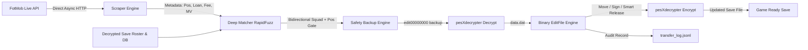

# FLEditScrape — Football Life & PES 2021 Transfer Tool

[](https://www.python.org/)
[]()
[]()
[](LICENSE)

An automated, safe, and intelligent player transfer synchronization tool for **SP Football Life** and **eFootball PES 2021**.

It automatically fetches live, verified football transfers from **FotMob's real-time transfer feed**, cross-verifies player positions, nationalities, ages, and squad rosters, handles squad limits with position-aware ability logic, auto-assigns conflict-free shirt numbers, protects tactical game plans, and writes updates directly into your `EDIT00000000` save file.

> [!NOTE]
> **Current Base Database: SP Football Life 2026**
> Always validate a base save before applying transfers. The pipeline now refuses
> structurally inconsistent inputs instead of publishing a corrupt output.

The canonical [base file](base/EDIT00000000) is
[**Gondowan's Mid-Summer EDIT**](https://www.reddit.com/r/SPFootballLife/comments/1v7z782/release_gondowans_midsummer_edit_file_more_than/)
dated 27 July 2026. It includes 500+ transfers, rating/position changes, revised
squad numbers, loan returns, manager changes, auto lineups, and promotion/
relegation updates for the English, French, Italian, and Spanish first/second
divisions. It does not add promoted clubs from third divisions or create players.

> [!IMPORTANT]
> This base requires **Football Life 26 Update 2.2** and SmokePatch's **National
> Squads Update**. According to its release notes, it will not work with UML,
> older FL26 versions/updates, or without the national-squad update. Start a new
> Master League or Become a Legend career after installing it.

---

## ❓ Why This Exists?

If you play SP Football Life or PES 2021, you know the struggle of keeping your game updated with the latest real-world transfers. 

- **Waiting for Official Updates:** Official FL patches take a long time to release.
- **Unreliable Option Files:** Waiting for random people on YouTube to upload their "Option Files" is frustrating. They are often **inaccurate, incomplete, or break your game's tactics**.
- **Missing the Hype:** Especially during the transfer window, when your favorite club just signed a new star player, you want to play with them *immediately*—not weeks later.

**FLEditScrape solves this completely.** Instead of waiting, this tool directly intercepts live, verified transfers from FotMob's real-time database and writes them perfectly into your save file—handling squad limits, shirt numbers, and positions automatically. Your game is now synced with the real world, every single day.

---

## 📥 Download Latest Save File (Cloud Sync)

Pre-built and updated `EDIT00000000` save files and visual transfer report cards are generated automatically every day via GitHub Actions. You can download the latest version directly without needing to install or run anything locally.

### How to Download:

1. Navigate to either the Sync Live Transfers [**Deep**](https://github.com/gvoze32/fleditscrape/actions/workflows/sync-deep.yml) or [**Fast**](https://github.com/gvoze32/fleditscrape/actions/workflows/sync-fast.yml) workflow in the Actions tab.
2. Click on the latest successful workflow run.
3. Under the **Artifacts** section at the bottom, download **`updated-fl-save-and-reports.zip`**.
4. Extract `EDIT00000000` and copy it into your game save directory:

| Game | Save Directory (Windows) |
|---|---|
| **SP Football Life 2026** | `Documents\KONAMI\eFootball PES 2021 SEASON UPDATE\2026\save\` |
| **eFootball PES 2021 Vanilla** | `Documents\KONAMI\eFootball PES 2021 SEASON UPDATE\<user_id>\save\` |

> [!TIP]
> **Custom Transfers**: To run sync on-demand with custom clubs, transfer windows, or deep European club coverage, fork this repository and trigger **Run workflow** in your fork's Actions tab.

---

## ⚡ Key Features

- **🚀 Live Real-Time Scraping**: Direct async HTTP stream from FotMob for all latest transfers, loans, releases, and signings (<0.5s execution, 0 bot blocks).
- **🌪️ Deep Mode (635 Indexed Clubs)**: Sequentially fetches every unique club currently present in the repository's validated FotMob indexes, including squad metadata that is absent from the global feed.
- **🛡️ Formation & Game Plan Doctor**: Preserves the active lineup mapping when roster slots are compacted. Roles belonging to a departing player are reset to the game's automatic/default selection.
- **🔢 Authentic Squad Sync**: Beyond just transfers, the script extracts real **Shirt Numbers** from FotMob squad lists and perfectly applies them in-game! Falls back to smart auto-assignment if the data is missing.
- **🎯 Tri-Factor Disambiguation Gate**: Strict multi-parameter matching combining name similarity, position gate, nationality verification, and age checks (+6.0 boost for exact nationality match, age-range alignment).
- **👥 Source-First Squad Verification**: Resolves duplicate player names against the source roster first, then the destination only as an idempotent fallback. Ambiguous identities and below-threshold context matches are skipped.
- **🚧 Fail-Closed Transfer Gate**: A move or release is applied only when the player's actual current club equals the matched source club. Stale events and source/current conflicts cannot move a player out of an unrelated team.
- **📅 Bounded Window Filtering**: Automatic summer/winter ranges have explicit end dates, leap years are supported, invalid `--since` values fail, and undated events are excluded from bounded runs.
- **📊 Visual HTML & Markdown Report Cards**: Automatically compiles clean, beautiful visual report tables with status badges, player positions, transfer fees, and confidence ratings into `transfer_summary.html` and GitHub Step Summaries.
- **🔄 Intelligent Loan & Loan Return Handling**: On-loan players are seamlessly transferred to their loan clubs, and players returning from loans (*End of Loan*) are accurately restored to their parent clubs.
- **📋 Contract Extension Auto-Filter**: Automatically detects and skips same-club contract renewals (`contractExtension: true`) to avoid redundant roster operations.
- **🧠 Position-Aware Overflow & Starting XI Protection**: When a squad reaches the 40-player limit, the tool automatically releases deep reserves with the lowest overall ability while **protecting Starting XI players** and **preserving at least 2 Goalkeepers per squad**.
- **📊 23k+ Universal Database**: Pre-indexed database of **23,780 players** and **580+ clubs** across 29 leagues. National teams are safely protected.
- **🛡️ Safe & Reversible**: Automatic rolling backups, pre/post-edit integrity checks, atomic verified encryption, dry-run simulation mode, and structured JSON Lines audit logs.

---

## 🏗️ Architecture Pipeline



---

## 💻 Developer & Local Setup (Advanced Users)

For developers and power users who wish to run and customize the tool locally (macOS / Linux / Windows WSL):

### 1. Installation

```bash
git clone https://github.com/gvoze32/fleditscrape.git
cd fleditscrape

# Create virtual environment
python3 -m venv .venv
source .venv/bin/activate

# Install dependencies
pip install -e .
```

### 2. Compile pesXdecrypter

```bash
cd vendor/pesXdecrypter && make && cd ../..
```

### 3. Running the CLI

```bash
# Preview transfers without altering files (Dry-run mode)
python run.py run --dry-run --edit-file base/EDIT00000000 --pages 5

# Validate the repaired legacy base against known-good FL26 invariants
python run.py validate --edit-file base/EDIT00000000

# Auto-select the active or most recently completed transfer window
python run.py run --edit-file base/EDIT00000000 --window auto --pages 100

# Repair the legacy base using multiple references, while preserving its
# original promotion/division membership
python run.py repair --edit-file base/EDIT00000000 \
  --reference /path/to/reference-1/EDIT00000000 \
  --reference /path/to/reference-2/EDIT00000000 \
  --reference /path/to/reference-3/EDIT00000000 \
  --output output/EDIT00000000

# Custom output destination or in-place update
python run.py run --edit-file base/EDIT00000000 -o output/EDIT00000000
python run.py run --edit-file /path/to/EDIT00000000 --in-place
```

---

## 📖 CLI Commands Reference

| Command | Usage | Description |
|---|---|---|
| `run` | `python run.py run --edit-file <PATH>` | Scrape live transfers and apply directly to edit file. |
| `log` | `python run.py log --last 20` | View human-readable summary of recently applied transfers. |
| `inspect` | `python run.py inspect --edit-file <PATH>` | Inspect teams, player counts, and offsets of any edit file. |
| `validate` | `python run.py validate --edit-file <PATH>` | Decrypt and reject duplicate club registrations, invalid rosters, or broken game-plan mappings. |
| `repair` | `python run.py repair --edit-file <PATH> --reference <PATH> ...` | Repair a legacy base by reference consensus without importing reference league memberships. |
| `schedule`| `python run.py schedule --interval-hours 6` | Run periodic sync in the background. |
| `cron` | `python run.py cron --interval-hours 6` | Generate Linux/macOS crontab entry string. |

**Parameter Flags for `run`:**
- `--deep`: **(Default in Actions)** Deep fetch across all **635 currently indexed unique clubs** to extract window-scoped transfers and real squad shirt numbers.
- `--club "Chelsea,Arsenal"`: Target specific club(s).
- `--window auto`: Selects the current or most recently completed transfer
  window from today's date: winter (Jan–Feb) or summer (Jun–Sep). New seasons
  are detected automatically; no metadata or workflow edits are needed.
- `--window summer`: Most recent Jun 1–Sep 30 range.
- `--window winter`: Jan 1–Feb 28/29 of the selected year.
- `--window all`: No lower date cutoff (future-effective deals are still held
  until their date). This is the widest option, but is slower and can replay
  irrelevant history; it is not the recommended workflow setting.
- `--since YYYY-MM-DD`: Include every dated transfer on/after the cutoff. The
  value is a manual override; normal canonical runs do not need it. The upper
  bound is always today, so a pre-agreement is not applied until its FotMob
  effective transfer date arrives.
- `--threshold N`: Fuzzy match threshold score (0–100, default: `80`).
- `--dry-run`: Simulation mode without writing changes to disk.

The transfer-window countdown sites are useful for checking registration
deadlines, which vary by league. They are not used as transaction feeds. Player
moves continue to come from FotMob, while the canonical workflows use the base
cutoff plus today's date so their result does not depend on a single league's
opening or closing day.

---

## 📁 Repository Structure

```text
fleditscrape/
├── .github/workflows/     # GitHub Actions workflows
│   ├── sync-deep.yml      # Daily cron (00:00 UTC) deep fetch of indexed clubs
│   └── sync-fast.yml      # Daily cron (00:00 UTC) fast global live feed
├── base/                  # Canonical validated Gondowan FL26 base
│   └── EDIT00000000
├── output/                # Generated updated save file
│   └── EDIT00000000
├── config.py              # Central configurations and paths
├── run.py                 # Unified CLI tool (run, repair, schedule, cron, inspect, validate, log)
├── pyproject.toml         # Package metadata and dependencies
├── README.md              # Project documentation
├── scraper/               # Scraper & Matching modules
│   ├── fotmob.py          # Direct async FotMob scraper
│   ├── matcher.py         # Position-aware fuzzy matcher & squad verification
│   └── models.py          # Transfer and MatchedTransfer data models
├── editor/                # PES 2021 / Football Life binary save editor
│   ├── editfile.py        # Binary parser, player mover, roster manager
│   ├── crypto.py          # pesXdecrypter wrapper (decrypt & re-encrypt)
│   ├── backup.py          # Automatic rolling backup system
│   ├── logger.py          # JSON Lines transfer audit logging
│   └── models.py          # PlayerInfo & TeamData data structures
├── data/                  # Game databases and alias tables
│   ├── players.csv        # 23k player database registry
│   ├── team_aliases.json  # Club name aliases and abbreviations
│   ├── name_overrides.json# Manual player name override mappings
│   └── leagues.json       # Supported playable leagues
├── vendor/                # Native decryption tools
│   └── pesXdecrypter/     # C implementation of PES 2021 crypto engine
└── tests/                 # Complete unit test suite (114 tests)
```

---

## 🧪 Testing

Run the automated test suite:

```bash
pytest -v
```

All **114 unit tests** pass across binary parsing, canonical path configuration, integrity repair/validation, automatic transfer-window selection, duplicate-name and source-roster priority, fail-closed roster decisions, bounded transfer ranges, future-effective transfer protection, CLI input validation, low-ID club handling, ambiguous-club safety, roster slot shifting, goalkeeper protection, position compatibility gates, and fuzzy matching.

---

## 🔒 License

This project is licensed under the [MIT License](LICENSE).
