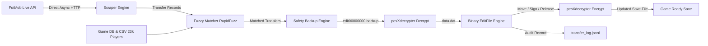

# FLEditScrape — Football Life & PES 2021 Transfer Tool

[](https://www.python.org/)
[]()
[](https://www.pessmokepatch.com/)
[](LICENSE)

An automated, safe, and intelligent player transfer synchronization tool for **Football Life (All Versions)** and **eFootball PES 2021**.

It automatically fetches live, verified football transfers from **FotMob's real-time transfer feed**, matches players and clubs against your game database using high-confidence fuzzy matching, creates automatic backups, and directly applies roster updates into your encrypted `EDIT00000000` save file.

---

## ⚡ Features

- **🚀 Live Real-Time Transfer Scraping**: Fetches up-to-the-minute global transfer data (transfers, loans, free agent releases, and signings) from FotMob via lightweight, direct async HTTP requests (<0.5s execution, 0 bot blocks).
- **🧠 Intelligent Fuzzy Matching**: RapidFuzz-powered matching with diacritic normalization, custom team aliases ([data/team_aliases.json](data/team_aliases.json)), and manual overrides ([data/name_overrides.json](data/name_overrides.json)).
- **📊 Universal Game Database**: Pre-indexed database of **23,780 players** and **580+ playable club teams** across 29 leagues. National teams are automatically protected and excluded from club transfer operations.
- **🔄 Universal Compatibility**: Works seamlessly across all Football Life versions and PES 2021.
- **🛡️ Save File Integrity & Safety**:
  - **Automatic Rolling Backups**: Automatically creates timestamped copies in `backups/` before any file modification.
  - **Dry-Run Mode**: Inspect and simulate transfer matching without modifying your save file.
  - **pesXdecrypter Integration**: Native high-speed binary decryption and encryption for PES 2021 edit files.
- **⏰ Automation & Scheduling**:
  - **Live Runner**: Apply transfers on-demand with a single command.
  - **Background Scheduler**: Continuous interval-based runner (`schedule --interval-hours 6`).
  - **Crontab Generator**: Ready-to-use cron job generator (`cron`).
  - **Audit Logging**: Structured JSON Lines log ([data/transfer_log.jsonl](data/transfer_log.jsonl)) recording every transfer with confidence score and timestamp.

---

## 🏗️ Architecture Pipeline



---

## 📁 Repository Structure

```text
fleditscrape/
├── config.py              # Central configurations and paths
├── run.py                 # Unified CLI tool (run, schedule, cron, inspect, log)
├── pyproject.toml         # Package metadata and dependencies
├── README.md              # Project documentation
├── scraper/               # Scraper & Matching modules
│   ├── fotmob.py          # Direct async FotMob transfer scraper
│   ├── matcher.py         # Fuzzy matching engine (players & clubs)
│   └── models.py          # Transfer and MatchedTransfer data models
├── editor/                # PES 2021 / Football Life binary save editor
│   ├── editfile.py        # Binary parser, player mover, roster manager
│   ├── crypto.py          # pesXdecrypter wrapper (decrypt & re-encrypt)
│   ├── backup.py          # Automatic rolling backup system
│   ├── logger.py          # JSON Lines transfer audit logging
│   └── models.py          # PlayerInfo & TeamData data structures
├── data/                  # Game databases and alias tables
│   ├── players.csv        # 23k player database registry
│   ├── team_aliases.json  # Club name aliases and abbreviations
│   ├── name_overrides.json# Manual name/ID override mappings
│   └── leagues.json       # Playable league definitions
├── vendor/                # Native decryption tools
│   └── pesXdecrypter/     # C implementation of PES2021 crypto engine
└── tests/                 # Complete unit test suite (57 tests)
    ├── test_editor.py     # Binary editor & slot safety tests
    ├── test_matcher.py    # Fuzzy matcher tests
    └── test_scraper.py    # FotMob parser & model tests
```

---

## 🚀 Getting Started

### 1. Requirements
- **Python 3.10+**
- **macOS, Linux, or Windows (WSL/Native)**
- **GCC / Clang** (for compiling `pesXdecrypter` if not already built)

### 2. Installation

```bash
git clone https://github.com/gvoze32/fleditscrape.git
cd fleditscrape

# Create and activate virtual environment
python3 -m venv .venv
source .venv/bin/activate

# Install dependencies
pip install -e .
pip install pytest
```

### 3. Compile pesXdecrypter (macOS / Linux)

If the binaries in `vendor/pesXdecrypter/` need to be built for your operating system:

```bash
cd vendor/pesXdecrypter
make
cd ../..
```

---

## 📖 Usage Guide

### 1. Preview Transfers (Dry-Run Mode)
Inspect matched transfers without modifying your save file:

```bash
python run.py run --dry-run --edit-file sample/EDIT00000000 --pages 2
```

### 2. Apply Live Transfers
Scrape and write transfers directly into your save file:

```bash
python run.py run --edit-file sample/EDIT00000000 --pages 2
```

**Common Flags:**
- `--edit-file PATH`: Path to your `EDIT00000000` save file (defaults to `config.EDIT_FILE_PATH`).
- `--pages N`: Number of pages to fetch from FotMob (50 transfers per page, default: `2`).
- `--popular`: Restrict scraping to major / popular transfers.
- `--threshold N`: Minimum fuzzy match confidence score (0-100, default: `80`).
- `--dry-run`: Simulate transfer matching without modifying the save file.

### 3. Continuous Background Scheduler
Run the transfer synchronization continuously on a timer:

```bash
python run.py schedule --interval-hours 6 --edit-file sample/EDIT00000000
```

### 4. Crontab Generator
Generate an automated cron job configuration for background execution on Linux/macOS:

```bash
python run.py cron --interval-hours 12
```

### 5. Inspect Save File Structure
View total players, playable teams, and player slots in any `EDIT00000000` file:

```bash
python run.py inspect --edit-file sample/EDIT00000000
```

### 6. View Audit Log
Display recent transfer operations recorded in `data/transfer_log.jsonl`:

```bash
python run.py log --last 25
```

---

## ⚙️ Configuration & Customization

| File | Description |
|---|---|
| [config.py](config.py) | Central settings (default paths, match thresholds, backup retention). |
| [data/team_aliases.json](data/team_aliases.json) | Custom team name aliases for matching variations (e.g., `Man Utd` → `Manchester United`). |
| [data/name_overrides.json](data/name_overrides.json) | Manual overrides for players with special nicknames or IDs. |
| [data/players.csv](data/players.csv) | Full player registry database (23,780 players). |

---

## 🧪 Running Tests

Execute the complete test suite with `pytest`:

```bash
source .venv/bin/activate
pytest -v
```

All **57 unit tests** cover:
- Binary save file reading, writing, moving, signing, releasing, and slot boundary safety.
- Fuzzy name and team matching algorithms.
- FotMob payload parsing and data model integrity.

---

## 💡 Troubleshooting & FAQ

### Where is my `EDIT00000000` save file located?
- **Windows / Steam / SP Football Life**:
  `C:\Users\<YourUsername>\Documents\KONAMI\eFootball PES 2021 SEASON UPDATE\save\EDIT00000000`
- **Linux (Wine / Proton / Steam Deck)**:
  `~/.steam/steam/steamapps/compatdata/.../pfx/drive_c/users/steamuser/Documents/KONAMI/.../save/EDIT00000000`
- **macOS / Custom Path**:
  You can point directly to any file using `--edit-file <path_to_EDIT00000000>`.

### Will this work across all versions?
Yes! It is fully compatible with all Football Life versions and PES 2021.

### Are my original saves safe?
Yes. Before any edit file is modified, an automated backup is created in the `backups/` folder with timestamp notation (`EDIT00000000.bak.YYYYMMDD_HHMMSS`).

---

## 🔒 License

This project is licensed under the [MIT License](LICENSE).
