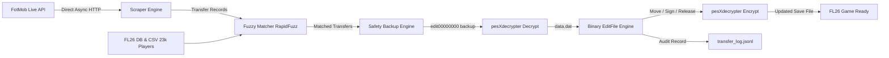

# FLEditScrape — Football Life 2026 (FL26) Transfer Automation Tool

An automated, safe, and intelligent player transfer synchronization tool for **SP Football Life 2026 (PES 2021 engine)**.

It automatically scrapes verified real-world football transfers from **FotMob's live transfer feed**, matches players and clubs against the internal FL26 database using high-confidence fuzzy matching, creates automatic backups, and directly applies roster updates into your encrypted `EDIT00000000` save file.

---

## ⚡ Features

- **Live Transfer Scraping**: Fetches up-to-the-minute global transfer data (transfers, loans, free agent releases, and signings) from FotMob via lightweight async HTTP API requests.
- **Intelligent Fuzzy Matching**: RapidFuzz-powered matching with diacritic stripping, team aliases ([data/team_aliases.json](data/team_aliases.json)), and manual overrides ([data/name_overrides.json](data/name_overrides.json)).
- **Comprehensive FL26 Database**: Pre-indexed database of **23,000+ players** and **580+ playable club teams** across 29 leagues. National teams are automatically excluded from transfer operations.
- **Save File Integrity & Safety**:
  - **Automatic Rolling Backups**: Always backs up your save file with timestamped copies in `backups/` before any write.
  - **Dry-Run Mode**: Inspect matched transfers and preview changes without modifying your save.
  - **pesXdecrypter Integration**: Native high-speed binary decryption and encryption for PES 2021 edit files.
- **Automation & Scheduling**:
  - **Live Runner**: Apply transfers on-demand with one command.
  - **Background Scheduler**: Continuous interval-based runner (`schedule --interval-hours 6`).
  - **Crontab Generator**: Ready-to-use cron job generator (`cron`).
  - **Audit Logging**: Structured JSON Lines log ([data/transfer_log.jsonl](data/transfer_log.jsonl)) recording every transfer.

---

## 🏗️ Architecture Pipeline



---

## 🚀 Getting Started

### 1. Requirements
- Python 3.10+
- macOS, Linux, or Windows
- GCC / Clang (for compiling `pesXdecrypter` if not already built)

### 2. Installation

Clone this repository and set up a virtual environment:

```bash
git clone https://github.com/your-username/fleditscrape.git
cd fleditscrape

# Create virtual environment
python3 -m venv .venv
source .venv/bin/activate

# Install dependencies
pip install -e .
pip install pytest
```

### 3. Compile pesXdecrypter (macOS / Linux)

If the binaries in `vendor/pesXdecrypter/` are not yet compiled for your system:

```bash
cd vendor/pesXdecrypter
make
cd ../..
```

---

## 📖 Usage Guide

### 1. Preview Transfers (Dry-Run Mode)
Inspect which transfers will be matched and applied without touching your save file:

```bash
python run.py run --dry-run --edit-file sample/EDIT00000000 --pages 2
```

### 2. Apply Live Transfers
Scrape and write transfers directly into your FL26 save file:

```bash
python run.py run --edit-file sample/EDIT00000000 --pages 2
```

Options:
- `--edit-file PATH`: Path to your `EDIT00000000` save file (defaults to `config.EDIT_FILE_PATH`).
- `--pages N`: Number of pages to fetch from FotMob (50 transfers per page, default: `2`).
- `--popular`: Restrict scraping to popular / major transfers only.
- `--threshold N`: Minimum fuzzy match confidence score (0-100, default: `80`).
- `--dry-run`: Simulate transfer matching without modifying the save file.

### 3. Continuous Scheduler
Run the transfer synchronization continuously in the background on a timer:

```bash
python run.py schedule --interval-hours 6 --edit-file sample/EDIT00000000
```

### 4. Crontab Generator
Generate an automated cron job line for background execution on Linux/macOS:

```bash
python run.py cron --interval-hours 12
```

### 5. Inspect Save File Structure
View total players, playable teams, and player slots in your `EDIT00000000` file:

```bash
python run.py inspect --edit-file sample/EDIT00000000
```

### 6. View Audit Log
Display recent transfer operations recorded in `data/transfer_log.jsonl`:

```bash
python run.py log --last 25
```

---

## ⚙️ Configuration & Customization

| File | Description |
|---|---|
| [config.py](config.py) | Central settings (default paths, match thresholds, backup retention). |
| [data/team_aliases.json](data/team_aliases.json) | Custom team name aliases for matching variations (e.g. `Man Utd` → `Manchester United`). |
| [data/name_overrides.json](data/name_overrides.json) | Manual overrides for players with special nicknames or IDs. |
| [data/players.csv](data/players.csv) | Full FL26 player registry database (23,780 players). |

---

## 🧪 Running Tests

Execute the complete test suite with `pytest`:

```bash
source .venv/bin/activate
pytest -v
```

All 57 unit tests cover:
- Binary save file reading, writing, moving, signing, releasing, and slot boundary safety.
- Fuzzy name and team matching algorithms.
- FotMob payload parsing and data model integrity.

---

## 🔒 Safety & License

- **Automatic Backups**: Backups are timestamped and preserved in the `backups/` directory. The last 10 backups are retained by default.
- **License**: MIT License.
