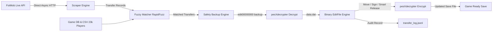

# FLEditScrape — Football Life & PES 2021 Transfer Tool

[](https://www.python.org/)
[]()
[](https://www.pessmokepatch.com/)
[](LICENSE)

An automated, safe, and intelligent player transfer synchronization tool for **Football Life (All Versions)** and **eFootball PES 2021**.

It automatically fetches live, verified football transfers from **FotMob's real-time transfer feed**, matches players and clubs using fuzzy matching, handles squad limits with position-aware ability logic, and writes updates directly into your `EDIT00000000` save file.

---

## ⚡ Key Features

- **🚀 Live Real-Time Scraping**: Direct async HTTP requests to FotMob for all latest transfers, loans, releases, and signings (<0.5s execution, 0 bot blocks).
- **🔄 Loan = Transfer Treatment**: On-loan players are seamlessly transferred to ensure accurate current squads.
- **🧠 Position-Aware Overflow & GK Protection**: When a team hits the 40-player limit, the tool automatically releases deep reserves with the lowest overall ability while **protecting Starting XI players** and **preserving at least 2 Goalkeepers per squad**.
- **📊 23k+ Universal Database**: Pre-indexed database of **23,780 players** and **580+ club teams** across 29 leagues. National teams are safely protected.
- **🤖 GitHub Actions Cloud Automation**: Automated daily sync in the cloud with downloadable updated save files via **GitHub Actions Artifacts**.
- **🛡️ Safe & Reversible**: Automatic rolling backups before every modification, dry-run simulation mode, and structured JSONL audit logs.

---

## 🏗️ Architecture Pipeline



---

## 📁 Repository Structure

```text
fleditscrape/
├── .github/workflows/     # GitHub Actions workflow (daily cloud sync + artifacts)
│   └── sync-transfers.yml
├── config.py              # Central configurations and paths
├── run.py                 # Unified CLI tool (run, schedule, cron, inspect, log)
├── pyproject.toml         # Package metadata and dependencies
├── README.md              # Project documentation
├── scraper/               # Scraper & Matching modules
│   ├── fotmob.py          # Direct async FotMob transfer scraper
│   ├── matcher.py         # Fuzzy matching engine (players & clubs)
│   └── models.py          # Transfer and MatchedTransfer data models
├── editor/                # PES 2021 / Football Life binary save editor
│   ├── editfile.py        # Binary parser, player mover, roster manager
│   ├── crypto.py          # pesXdecrypter wrapper (decrypt & re-encrypt)
│   ├── backup.py          # Automatic rolling backup system
│   ├── logger.py          # JSON Lines transfer audit logging
│   └── models.py          # PlayerInfo & TeamData data structures
├── data/                  # Game databases and alias tables
│   ├── players.csv        # 23k player database registry
│   ├── team_aliases.json  # Club name aliases and abbreviations
│   ├── name_overrides.json# Manual name/ID override mappings
│   └── leagues.json       # Playable league definitions
├── vendor/                # Native decryption tools
│   └── pesXdecrypter/     # C implementation of PES2021 crypto engine
└── tests/                 # Complete unit test suite (66 tests)
```

---

## 🚀 Quick Start (Local)

### 1. Installation

```bash
git clone https://github.com/gvoze32/fleditscrape.git
cd fleditscrape

# Create virtual environment
python3 -m venv .venv
source .venv/bin/activate

# Install package
pip install -e .
```

### 2. Compile pesXdecrypter (macOS / Linux)

```bash
cd vendor/pesXdecrypter && make && cd ../..
```

### 3. Run Transfer Sync

```bash
# Preview transfers (Dry-run mode)
python run.py run --dry-run --edit-file sample/EDIT00000000 --pages 5

# Apply live transfers directly
python run.py run --edit-file sample/EDIT00000000 --pages 10
```

---

## ☁️ GitHub Actions Cloud Automation

You can run the transfer sync entirely in the cloud without keeping your computer on:

1. **Scheduled Daily Sync**: Runs automatically every day at **00:00 UTC (07:00 WIB)**.
2. **On-Demand Manual Trigger**:
   - Go to **Actions** ➡️ **Sync Live Transfers** ➡️ **Run workflow**.
   - Choose your transfer window (`auto`, `summer`, `winter`, `all`) and number of pages.
3. **Download Updated Save File**:
   - Once completed, open the workflow run and scroll to **Artifacts**.
   - Download **`updated-fl-save-and-logs.zip`** to get your freshly updated `EDIT00000000`.

---

## 📖 CLI Commands Reference

| Command | Usage | Description |
|---|---|---|
| `run` | `python run.py run --edit-file <PATH>` | Scrape live transfers and apply to edit file. |
| `log` | `python run.py log --last 20` | View human-readable summary of recently applied transfers. |
| `inspect` | `python run.py inspect --edit-file <PATH>` | Inspect teams, player counts, and offsets of any edit file. |
| `schedule`| `python run.py schedule --interval-hours 6` | Run periodic sync in the background. |
| `cron` | `python run.py cron --interval-hours 6` | Generate Linux/macOS crontab entry string. |

**Common Flags for `run`:**
- `--window {auto,summer,winter,all}`: Transfer window cutoff date (default: `auto`).
- `--since YYYY-MM-DD`: Custom cutoff date (e.g. `--since 2026-06-01`).
- `--pages N`: Maximum FotMob pages to scrape (50 transfers/page, default: `10`).
- `--popular`: Scrape only high-profile / major transfers.
- `--threshold N`: Fuzzy match threshold score (0–100, default: `80`).
- `--dry-run`: Test and display matches without writing changes.

---

## 🧪 Testing

Run the automated test suite:

```bash
pytest -v
```

All **66 unit tests** pass, covering binary parsing, roster slot shifting, loan transfers, goalkeeper protection, and fuzzy matching.

---

## 🔒 License

This project is licensed under the [MIT License](LICENSE).
