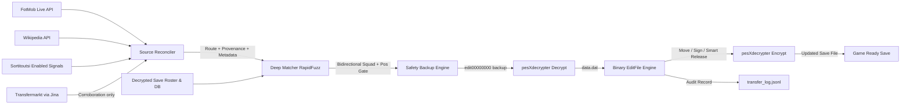

# FLEditScrape — Football Life & PES 2021 Transfer Tool

[](https://www.python.org/)
[]()
[]()
[](LICENSE)

An automated, safe, and intelligent player transfer synchronization tool for **SP Football Life** and **eFootball PES 2021**.

It reconciles **FotMob**, confirmed **Wikipedia** transfer lists, moderated
**Sortitoutsi** submissions, and recent **Transfermarkt** routes, verifies player
identity against the current FL26 catalog and the save's actual roster state,
handles stale loan chains, assigns conflict-free shirt numbers, protects tactical
game plans, and writes validated updates into your `EDIT00000000` save file.

> [!NOTE]
> **Current Base Database: SP Football Life 2026**
> Always validate a base save before applying transfers. The pipeline now refuses
> structurally inconsistent inputs instead of publishing a corrupt output.

The canonical [base file](base/EDIT00000000) is
[**Gondowan's Mid-Summer EDIT**](https://www.reddit.com/r/SPFootballLife/comments/1v7z782/release_gondowans_midsummer_edit_file_more_than/)
dated 27 July 2026. It includes 500+ transfers, rating/position changes, revised
squad numbers, loan returns, manager changes, auto lineups, and promotion/
relegation updates for the English, French, Italian, and Spanish first/second
divisions. It does not add promoted clubs from third divisions or create players.

> [!IMPORTANT]
> This base requires **Football Life 26 Update 2.2** and SmokePatch's **National
> Squads Update**. According to its release notes, it will not work with UML,
> older FL26 versions/updates, or without the national-squad update. Start a new
> Master League or Become a Legend career after installing it.

---

## ❓ Why This Exists?

If you play SP Football Life or PES 2021, you know the struggle of keeping your game updated with the latest real-world transfers. 

- **Waiting for Official Updates:** Official FL patches take a long time to release.
- **Unreliable Option Files:** Waiting for random people on YouTube to upload their "Option Files" is frustrating. They are often **inaccurate, incomplete, or break your game's tactics**.
- **Missing the Hype:** Especially during the transfer window, when your favorite club just signed a new star player, you want to play with them *immediately*—not weeks later.

**FLEditScrape solves this completely.** Instead of waiting, this tool reconciles a live roster feed, confirmed seasonal lists, and moderated fast signals before updating your save—handling squad limits, shirt numbers, and positions automatically. Your game is now synced with the real world, every single day.

---

## 📥 Download Latest Save File (Cloud Sync)

Pre-built and updated `EDIT00000000` save files and visual transfer report cards are generated automatically every day via GitHub Actions. You can download the latest version directly without needing to install or run anything locally.

### How to Download:

1. Navigate to either the Sync Live Transfers [**Deep**](https://github.com/gvoze32/fleditscrape/actions/workflows/sync-deep.yml) or [**Fast**](https://github.com/gvoze32/fleditscrape/actions/workflows/sync-fast.yml) workflow in the Actions tab.
2. Click on the latest successful workflow run.
3. Under the **Artifacts** section at the bottom, download **`updated-fl-save-and-reports.zip`**.
4. Extract `EDIT00000000` and copy it into your game save directory:

| Game | Save Directory (Windows) |
|---|---|
| **SP Football Life 2026** | `Documents\KONAMI\eFootball PES 2021 SEASON UPDATE\2026\save\` |
| **eFootball PES 2021 Vanilla** | `Documents\KONAMI\eFootball PES 2021 SEASON UPDATE\<user_id>\save\` |

> [!TIP]
> **Custom Transfers**: To run sync on-demand with custom clubs, transfer windows, or deep European club coverage, fork this repository and trigger **Run workflow** in your fork's Actions tab.

---

## ⚡ Key Features

- **🚀 Four Complementary Sources**: FotMob supplies global history and squad metadata. Wikipedia dynamically reads every men's page in each selected seasonal category: explicit dated tables provide confirmed events, while undated club `In`/`Out` lists provide route corroboration. Enabled Sortitoutsi submissions add fast destination signals with proof links, and Transfermarkt adds recent complete routes with stable player, club, and transfer IDs.
- **🤝 Provenance-Aware Reconciliation**: Duplicate events are merged across sources without losing IDs, citations, effective dates, or proof URLs. Undated Wikipedia club-list and Transfermarkt records only enrich one unique existing route and never trigger roster mutations independently.
- **🌪️ Deep Mode (504 One-to-One Clubs)**: Sequentially fetches each FotMob identity that maps unambiguously to one PES club, including squad metadata absent from the global feed.
- **🛡️ Formation & Game Plan Doctor**: Preserves the active lineup mapping when roster slots are compacted. Roles belonging to a departing player are reset to the game's automatic/default selection.
- **🔢 Authentic Squad Sync**: The script extracts real **Shirt Numbers** from FotMob squad lists and applies conflict-free updates in-game. A number already owned by another squad member is safely skipped without cancelling unrelated transfers.
- **🎯 Roster-Aware Identity Gate**: Matches the current 29.5k FL26 player catalog, then resolves duplicate names against source/destination roster context. Position, nationality, and age evidence is used only when it is genuinely present.
- **👥 Source-First Squad Verification**: Resolves duplicate player names against the source roster first, then the destination only as an idempotent fallback. Ambiguous identities and below-threshold context matches are skipped.
- **🪪 Stable Player Identity**: Persists FotMob `playerId` ↔ PES player-ID evidence per output save and audits Transfermarkt player, club, and transfer IDs, so renamed players can be recovered while conflicting histories are rejected.
- **🚧 Fail-Closed Transfer Gate**: A move or release is applied only when the player's actual current club equals the matched source club. A destination-only Sortitoutsi signal requires `Enabled` status, a proof URL, an exact player match, one unique current FL26 roster, and a valid destination; otherwise it is skipped.
- **📅 Cumulative Auto Replay**: Automatic mode scans every available FotMob page through today, while manual summer/winter ranges remain bounded and future-effective or undated events are excluded.
- **📊 Visual HTML & Markdown Report Cards**: Separates real club transfers from shirt-number-only changes, with responsive tables, accurate metrics, confidence ratings, and a concise GitHub Step Summary.
- **🔄 Intelligent Loan & Loan Return Handling**: On-loan players are seamlessly transferred to their loan clubs, and players returning from loans (*End of Loan*) are accurately restored to their parent clubs.
- **📋 Contract Extension Auto-Filter**: Automatically detects and skips same-club contract renewals (`contractExtension: true`) to avoid redundant roster operations.
- **🧠 Fail-Closed Squad Limits**: A full 40-player squad is skipped by default. The optional overflow-release mode is rejected unless complete position and OVR metadata exists for every rostered player, preventing arbitrary releases from a name-only catalog.
- **📊 Current FL26 Catalog**: The Update 2.2 reference contains **29,502 players**; a roster-only legacy fallback covers exceptional IDs without reintroducing thousands of stale free agents. Every roster ID must resolve or the run aborts.
- **🛡️ Safe & Reversible**: Automatic rolling backups, pre/post-edit integrity checks, atomic verified encryption, per-output process locking, dry-run simulation mode, and structured JSON Lines audit logs.

---

## 🏗️ Architecture Pipeline



---

## 💻 Developer & Local Setup (Advanced Users)

For developers and power users who wish to run and customize the tool locally (macOS / Linux / Windows WSL):

### 1. Installation

```bash
git clone https://github.com/gvoze32/fleditscrape.git
cd fleditscrape

# Create virtual environment
python3 -m venv .venv
source .venv/bin/activate

# Install dependencies
pip install -e .
```

### 2. Compile pesXdecrypter

```bash
cd vendor/pesXdecrypter && make && cd ../..
```

### 3. Running the CLI

```bash
# Preview transfers without altering files (Dry-run mode)
python run.py run --dry-run --edit-file base/EDIT00000000

# Validate the repaired legacy base against known-good FL26 invariants
python run.py validate --edit-file base/EDIT00000000

# Replay all available effective transfers through today
python run.py run --window auto

# Explicit full rebuild from the canonical base
python run.py run --from-base --window auto

# Repair the legacy base using multiple references, while preserving its
# original promotion/division membership
python run.py repair --edit-file base/EDIT00000000 \
  --reference /path/to/reference-1/EDIT00000000 \
  --reference /path/to/reference-2/EDIT00000000 \
  --reference /path/to/reference-3/EDIT00000000 \
  --output output/EDIT00000000

# Custom output destination or in-place update
python run.py run --edit-file base/EDIT00000000 -o output/EDIT00000000
python run.py run --edit-file /path/to/EDIT00000000 --in-place
```

---

## 📖 CLI Commands Reference

| Command | Usage | Description |
|---|---|---|
| `run` | `python run.py run --edit-file <PATH>` | Scrape live transfers and apply directly to edit file. |
| `log` | `python run.py log --last 20` | View human-readable summary of recently applied transfers. |
| `inspect` | `python run.py inspect --edit-file <PATH>` | Inspect teams, player counts, and offsets of any edit file. |
| `validate` | `python run.py validate --edit-file <PATH>` | Decrypt and reject duplicate club registrations, invalid rosters, or broken game-plan mappings. |
| `repair` | `python run.py repair --edit-file <PATH> --reference <PATH> ...` | Repair a legacy base by reference consensus without importing reference league memberships. |
| `schedule`| `python run.py schedule --interval-hours 6` | Run periodic sync in the background. |
| `cron` | `python run.py cron --interval-hours 6` | Generate Linux/macOS crontab entry string. |

**Parameter Flags for `run`:**
- `--deep`: **(Default in Actions)** Deep fetch across all **504 currently validated one-to-one clubs** to extract transfers and real squad shirt numbers.
- `--club "Chelsea,Arsenal"`: Target specific club(s).
- `--window auto`: Recommended. Replays all dated transfers available from
  FotMob through today. Pagination continues until the feed is empty or repeats,
  with an internal safety cap. New seasons need no metadata, page count, or
  workflow edits.
- `--window summer`: Most recent Jun 1–Sep 30 range.
- `--window winter`: Jan 1–Feb 28/29 of the selected year.
- `--window all`: Explicit unbounded-history mode. Usually unnecessary because
  canonical `auto` already performs safe cumulative replay.
- `--since YYYY-MM-DD`: Include every dated transfer on/after the cutoff. The
  value is a manual override; normal canonical runs do not need it. The upper
  bound is always today, so a pre-agreement is not applied until its FotMob
  effective transfer date arrives.
- `--threshold N`: Fuzzy match threshold score (0–100, default: `80`).
- `--fotmob-only`: Disable the fail-soft Wikipedia, Sortitoutsi, and Transfermarkt
  supplements for debugging or source comparison. Club-focused `--club` runs are
  already FotMob-only so their requested scope remains deterministic.
- `--dry-run`: Simulation mode without writing changes to disk.
- `--from-base`: Explicitly rebuild from `base/EDIT00000000`. Without this
  flag, a default run continues from an existing successful output so older
  transfers cannot disappear on a later scheduled run.
- `--allow-overflow-release`: Opt in to releasing the displayed lowest-priority
  player when a destination roster is already full. This currently fails closed
  because the bundled name catalog has no complete position/OVR metadata. Without
  this flag, the transfer is safely skipped.

Any HTTP/API failure before a complete FotMob snapshot is read aborts the run;
partial FotMob results are never written to the edit file. Wikipedia,
Sortitoutsi, and Transfermarkt are supplemental and fail independently, so an
outage or rate limit does not discard a complete FotMob snapshot. Dry-run and
real-run share the same chronological roster planner, including loan-chain
history from previous successful runs.
Loan history is isolated per output save, and the scheduler
survives a fail-closed iteration instead of terminating permanently.

The transfer-window countdown sites are useful for checking registration
deadlines, which vary by league. They are not used as transaction feeds. Player
moves come from the reconciled source pipeline. The first default run starts
from the base; later runs continue from the last verified output while still
reading cumulative effective transfer history, so their result does not depend
on a single league's opening or closing day.

---

## 📁 Repository Structure

```text
fleditscrape/
├── .github/workflows/     # GitHub Actions workflows
│   ├── sync-deep.yml      # Daily cron (00:00 UTC) deep fetch of indexed clubs
│   └── sync-fast.yml      # Daily cron (00:00 UTC) fast global live feed
├── base/                  # Canonical validated Gondowan FL26 base
│   └── EDIT00000000
├── output/                # Generated updated save file
│   └── EDIT00000000
├── config.py              # Central configurations and paths
├── run.py                 # Unified CLI tool (run, repair, schedule, cron, inspect, validate, log)
├── pyproject.toml         # Package metadata and dependencies
├── README.md              # Project documentation
├── scraper/               # Scraper & Matching modules
│   ├── fotmob.py          # Direct async FotMob scraper
│   ├── wikipedia.py       # Global men's seasonal event and route corroborator
│   ├── sortitoutsi.py     # Enabled community-signal adapter
│   ├── transfermarkt.py   # Undated complete-route corroborator via Jina Reader
│   ├── sources.py         # Cross-source provenance reconciliation
│   ├── matcher.py         # Position-aware fuzzy matcher & squad verification
│   └── models.py          # Transfer and MatchedTransfer data models
├── editor/                # PES 2021 / Football Life binary save editor
│   ├── editfile.py        # Binary parser, player mover, roster manager
│   ├── player_catalog.py  # Versioned FL26 identity catalog + coverage proof
│   ├── locking.py         # Cross-process output lock
│   ├── crypto.py          # pesXdecrypter wrapper (decrypt & re-encrypt)
│   ├── backup.py          # Automatic rolling backup system
│   ├── logger.py          # JSON Lines transfer audit logging
│   └── models.py          # PlayerInfo & TeamData data structures
├── data/                  # Game databases and alias tables
│   ├── FL2622wc_players.txt # Canonical FL26 Update 2.2 player names
│   ├── players.csv        # Roster-only fallback for exceptional legacy IDs
│   ├── team_aliases.json  # Club name aliases and abbreviations
│   └── name_overrides.json# Manual player name override mappings
├── vendor/                # Native decryption tools
│   └── pesXdecrypter/     # C implementation of PES 2021 crypto engine
└── tests/                 # Complete regression and integration test suite
```

---

## 🧪 Testing

Run the automated test suite:

```bash
pytest -v
```

The suite covers binary parsing, canonical path configuration, integrity
repair/validation, complete-scrape enforcement, cumulative replay and
pagination, stateful roster planning, loan-chain history, canonical club
deduplication, overflow authorization, report separation, roster slot shifting,
goalkeeper protection, catalog coverage, process locking, position compatibility
gates, and fuzzy matching.

---

## 🔒 License

This project is licensed under the [MIT License](LICENSE).
